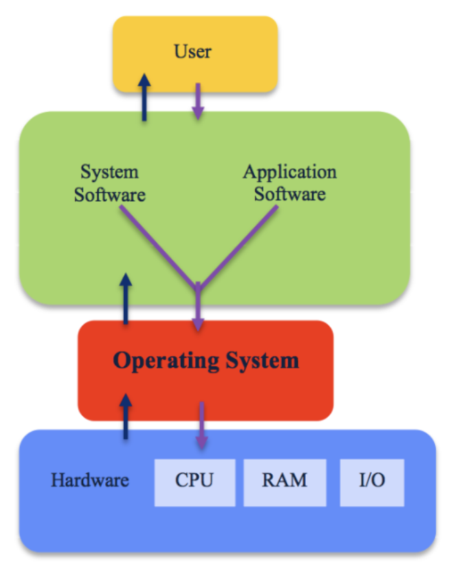
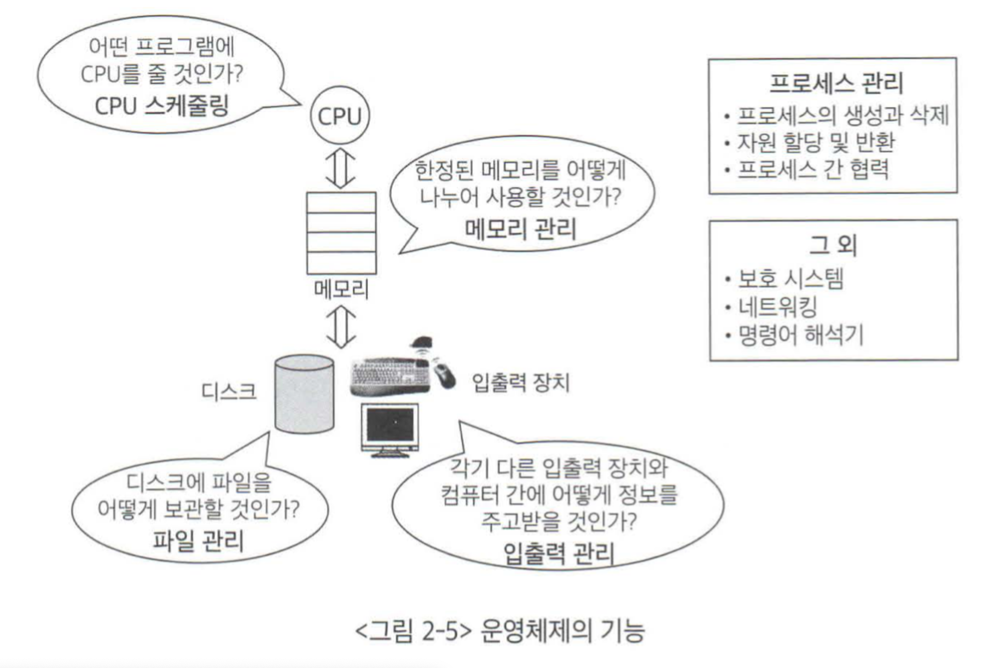

## 목차
- [운영체제 개요](#운영체제-개요)
  - [운영체제의 정의](#운영체제의-정의)
  - [운영체제의 기능](#운영체제의-기능)
  - [운영체제의 분류](#운영체제의-분류)
    - [다중사용자에 대한 동시 지원 여부](#다중사용자에-대한-동시-지원-여부)
    - [작업을 처리하는 방식에 따른 분류](#작업을-처리하는-방식에-따른-분류)
  - [운영체제의 자원 관리 기능](#운영체제의-자원-관리-기능)
    - [운영체제의 자원 관리 기능](#운영체제의-자원-관리-기능-1)
    - [CPU 스케줄링](#cpu-스케줄링)
    - [메모리 관리](#메모리-관리)
    - [인터럽트](#인터럽트)
  - [정리](#정리)

# 운영체제 개요
## 운영체제의 정의
> 운영체제  
> 컴퓨터 하드웨어 바로 윗단에 설치되는 소프트웨어

운영체제는 사용자 및 다른 모든 소프트웨어와 하드웨어를 연결하는 소프트웨어 계층으로 위의 그림과 같다.  
__사용자는 하드웨어 자체를 직접 다루기 쉽지 않으므로, 하드웨어 위에 기본적으로 운영체제를 탑재해 전원을 켰을 때 손쉽게 사용할 수 있는 상태__ 가 되도록한다.  

소프트웨어가 컴퓨터 시스템에서 실행되기 위해서는 메모리에 그 프로그램이 올라가 있어야한다. 운영체제 자체도 하나의 소프트웨어로서 전원이 켜짐과 동시에 메모리에 올라간다. 이 때, 메모리에 상주하는 운영체제의 부분을 커널이라고 부르며, 남은 운영체제는 필요할 때 메모리에 올려 사용한다.

- 좁은 의미의 운영체제
  - 커널(운영체제 코드 중에서도 핵심적인 부분)
- 넓은 의미의 운영체제
  - 커널뿐만이 아닌 시스템을 위한 유틸리티들을 광범위하게 포함한다.
  - 예를 들어, MS 윈도우 환경에서 파일을 복사하는 프로그램 등이 해당

 

## 운영체제의 기능
> 운영체제의 역할은 하드웨어를 위한 역할과 사용자를 위한 역할 두 가지로 나눌 수 있다.

- 사용자 편의 기능
  - 운영체제는 사용자가 다루기 힘든 복잡한 부분을 대신 맡아 처리하고, 사용자는 자세한 내용을 알지 못해도 프로그램을 실행할 수 있게 도와준다.
  - 예를 들어 사용자는 파일이 디스크에 어떻게 저장되는지 자세히 모르지만, 운영체제가 제공하는 편리한 인터페이스를 통해 파일을 손쉽게 저장하거나 파일의 내용을 꺼내볼 수 있다.
- 자원 관리 기능
  - 운영체제는 컴퓨터 시스템 내의 자원을 효율적으로 관리하는 일도 한다.
  - CPU, 메모리, 하드디스크 등 하드웨어 뿐만이 아닌 소프트웨어 자원까지 관리한다.
  - 운영체제는 자원을 효율적으로 관리해 가장 좋은 성능을 내도록 한다.
- 보안 및 보호 기능
  - 악의성 프로그램을 작성해 다른 사용자 프로그램이 올라가 있는 메모리 영역을 참조
  - 다른 사용자의 사적인 파일에 접근
  - 운영체제 자체가 올라가 있는 메모리 영역 변경
  - 운영체제는 위와 같은 위험으로부터 보호를 하는 기능도 수행한다.

 

## 운영체제의 분류
> 운영체제는 동시 작업을 지원하는지의 여부에 따라 단일작업용 운영체제와 다중작업용 운영체제로 나눌 수 있다.

__단일작업용 운영체제__  
단일작업용 운영체제는 한 번에 하나의 프로그램만 실행시킬 수 있는 운영체제다. 초창기 운영체제는 대개 단일작업용 운영체제에 해당되었다.  

__다중작업용 운영체제__  
최근에는 대부분의 운영체제가 동시에 2개 이상의 프로그램을 처리할 수 있는 다중작업을 지원한다.  
운영체제가 다중작업을 처리할 때에는 여러 프로그램이 CPU와 메모리를 공유하게 된다. 이 때, CPU는 매 순간 하나의 프로그램만 처리할 수 있기 때문에 여러 프로그램을 실행했다고 해서 동시에 실행되는 것이 아닌 번갈아 가면서 실행되는 것이다. CPU의 처리 속도가 워낙 빨라 사용자 입장에서는 동시에 처리되는 것처럼 보이는 것이다. 이와 같이 CPU의 작업시간을 여러 프로그램들이 조금씩 나누어 쓰는 시스템을 시분한 시스템이라고 부른다.  

### 다중사용자에 대한 동시 지원 여부
단일 사용자용 운영체제
- 한 번에 한 명의 사용자만이 사용하도록 허용하는 운영체제

다중 사용자용 운영체제
- 여러 사용자가 동시에 접속해 사용할 수 있게 하는 운영체제

### 작업을 처리하는 방식에 따른 분류

__일괄처리__
- 요청된 작업을 일정량씩 모아서 한꺼번에 처리하는 방식
- 모든 작업이 완전히 종료된 후에 결과를 얻을 수 있음
- 사용자 입장에서는 응답시간이 길다는 단점
- 예시로는 초창기 컴퓨터에 사용되던 펀치 카드 처리 시스템

__시분할 방식__
- 여러 작업을 수행할 때 컴퓨터의 처리 능력을 일정한 시간 단위로 분할해 사용하는 방식이다.
- 현재 대부분의 컴퓨터는 시분할 방식을 사용한다.
- 사용자의 요청에 대한 결과를 곧바로 얻을 수 있는 시스템을 대화형 시스템
  - 이는 시분할 방식의 대표적인 특징이다.

__실시간 운영체제__
실시간 운영체제는 정해진 시간 안에 어떠한 일이 반드시 처리됨을 보장해야 하는 시스템에서 사용된다.

- 예) 원자로, 공장 제어 시스템, 미사일 제어 시스템 등
- 실시간 시스템은 경성 실시간 시스템과 연성 실시간 시스템 두 가지로 나눌 수 있다.
  - 경성 실시간 시스템은 주어진 시간을 지키지 못할 경우 매우 위험한 결과를 초래할 수 있는 시스템이다.
  - 예) 로켓, 원자로 제어 시스템
  - 연성 실시간 시스템은 위험한 결과를 초래하지는 않지만, 내용이 정확히 전달되지 않을 우려가 있다.
  - 예) 멀티 미디어 스트리밍 시스템

 

## 운영체제의 자원 관리 기능

### 운영체제의 자원 관리 기능

- 하드웨어 자원 : CPU와 메모리를 비롯해 주변장치 또는 입출력 장치라 불리는 장치들
### CPU 스케줄링
> CPU를 가장 효율적으로 사용하면서도 특정 프로세스가 불이익을 당하지 않도록 하는 것

- 선입선출 (First Come First Served) : 먼저 온 것 먼저 처리
    - CPU 자체의 효율저 사용은 문제 없지만 전체 시스템 입장에서는 비효율적
    - ❌ 짧은 시간만 CPU를 사용하면 되는 프로세스들이 계속 기다려야 됨
- 라운드 로빈 (Round Robin)
    - CPU를 한 번 할당받아 사용할 수 있는 시간을 고정된 시간으로 제한
    - 일정 시간이 지나면 CPU를 내어놓고 제일 뒤로 가서 줄 서야 함
    - 일반적으로 할당시간은 밀리초 단위를 사용해서 1초 이하의 응답시간을 보장
- 우선순위 (priority)
    - 우선순위가 높은 프로세스에 CPU 먼저 할당
    - 기다린 시간이 늘어날수록 우선순위를 높임

### 메모리 관리
> 한정된 메모리 공간에 여러 프로그램을 수용하기 위해

- 고정분할 (fixed partition)
    - 물리적 메모리를 몇 개의 분할로 미리 나누어 관리
    - ❌ 융통성이 없음 (메모리에 동시 적재되는 최대 프로그램 수가 분할 개수로 한정됨)
    - ❌ 메모리를 효율적으로 사용할 수 없음 (분할의 크기보다 큰 프로그램은 적재 불가능, 분할의 크기보다 작은 프로그램이 적재되는 경우 메모리 낭비)
    - 내부조각 : 해당 분할에 올라온 프로그램에 의해 사용되지 않고, 다른 프로그램에도 할당될 수 없는 낭비공간
- 가변분할 (variable partition)
    - 매 시점 프로그램의 크기에 맞게 메모리 분할해서 사용
    - ❌ 물리적 메모리의 크기보다 더 큰 프로그램은 여전히 불가능
    - 분할의 크기와 개수가 동적으로 변하므로 기술적 관리기법 필요
    - 외부조각 : 프로그램에 할당되지는 않았지만 크기가 작아 프로그램을 올리지 못하는 낭비공간
- 가상메모리 (virtual memory) : 가장 널리 사용되는 메모리 관리 기법
    - ✅ 물리적 메모리보다 더 큰 프로그램이 실행되는 것 지원
    - 모든 프로그램은 물리적 메모리와 독립적으로 0번지부터 시작하는 자신만의 가상메모리 주소를 가짐
    - 운영체제는 이 가상메모리 주소를 물리적 메모리 주소로 매핑하는 기술을 이용해 주소 변환 후 프로그램을 물리적 메모리에 올림
    - 현재 사용되고 있는 부분만 메모리에 올리고, 나머지는 하드디스크와 같은 보조기억장치(스왑 영역)에 저장해두었다가 필요할 때 적재
    - 페이징(paging) : 동일한 단위로 메모리를 나누는 기법, 프로그램을 구성하는 가상메모리 주소 공간은 페이지(page)라는 동일한 크기의 작은 단위로 나누어 물리적 메모리와 스왑 영역에 일부분씩 저장

### 인터럽트
> 주변장치 및 입출력 장치의 관리

- 주변장치들은 CPU가 필요한 경우 신호를 발생시켜 서비스를 요청 ⇒ 인터럽트
- CPU는 스케줄링에 따라 작업을 수행하다가 인터럽트가 발생하면 잠시 멈추고 요청 서비스 수행 ⇒ 인터럽트 처리 완료 후 원래 하던 작업 계속 수행
- 일터럽트가 발생했을 때 직전의 작업상태를 잠시 저장해둠
- 컨트롤러(controller) : 각 장치마다 일어나는 업무를 관리하기 위한 작은 CPU

## 정리

[피카](https://github.com/pika96/TIL/blob/master/%EC%9A%B4%EC%98%81%EC%B2%B4%EC%A0%9C/%EC%9A%B4%EC%98%81%EC%B2%B4%EC%A0%9C%EC%99%80%20%EC%A0%95%EB%B3%B4%EA%B8%B0%EC%88%A0%EC%9D%98%20%EC%9B%90%EB%A6%AC/%EC%9A%B4%EC%98%81%EC%B2%B4%EC%A0%9C%20%EA%B0%9C%EC%9A%94.md) [제리](https://jaeseongdev.notion.site/d66e1c4d15724ba8b068e2daa0dd376d) [바다](https://xrabcde.notion.site/OS-1-2-38f29d0adaf142fd96e4e0df8d75c2ec) [마크](https://github.com/binghe819/TIL/blob/master/OS/%EC%9A%B4%EC%98%81%EC%B2%B4%EC%A0%[…]%20%EC%9A%B4%EC%98%81%EC%B2%B4%EC%A0%9C%20%EA%B0%9C%EC%9A%94.md) [우기](https://jujubebat.github.io/cs/OS-Introduction/)