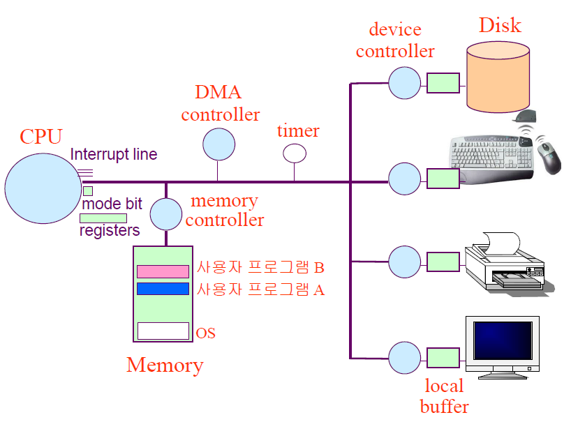

# 목차

 

- [목차](#목차)
- [컴퓨터 시스템의 구조](#컴퓨터-시스템의-구조)
- [CPU 연산과 I/O 연산](#cpu-연산과-io-연산)
- [인터럽트의 일반적 기능](#인터럽트의-일반적-기능)
- [인터럽트 핸들링](#인터럽트-핸들링)
- [입출력 구조](#입출력-구조)
- [DMA](#dma)
- [저장장치의 구조](#저장장치의-구조)
- [하드웨어 보안](#하드웨어-보안)
- [메모리 보안](#메모리-보안)
- [CPU 보호](#cpu-보호)
- [시스템 콜을 이용한 입출력 수행](#시스템-콜을-이용한-입출력-수행)

 

# 컴퓨터 시스템의 구조
* 입력 (input) : 컴퓨터 내부로 데이터가 들어오는 것
* 출력 (output) : 컴퓨터 외부장치로 데이터가 나가는 것

 출처: 운영체제와 정보기술의 원리

* 메모리와 입출력 장치 등의 각 하드웨어 장치에는 **컨트롤러** (일종의 작은 CPU) 라는 것이 붙어있음
* 운영체제는 컴퓨터가 부팅될 때부터 항상 메모리에 올라가 있음 : **커널**(항상 메모리에 올라가 있는 부분)

 

# CPU 연산과 I/O 연산

 

🤔 연산

* 입출력 장치들의 I/O 연산은 입출력 컨트롤러가 담당.
* 컴퓨터 내에서 수행되는 연산은 메인 CPU가 담당.

 

💁‍♂️ 입출력 장치와 메인 CPU는 동시에 수행 가능한가?

* 두 가지 일이 다른 곳에서 발생하기 때문에 가능하다.
  * A는 하드디스크에서 어떠한 정보를 읽어오는 작업을 수행. (컨트롤러 사용)
  * B는 CPU를 할당받아 코드를 수행. (CPU 사용)
* 두 가지 일이 다른 곳에서 발생하므로 동시에 수행되는 것이 가능하다.

 

🤔 로컬 버퍼 (local buffer)

* 장치 컨트롤러에서 장치로부터 들어오고 나가는 데이터를 임시로 저장하기 위한 작은 메모리.
* 장치 컨트롤러에서 데이터를 읽어와서 로컬 버퍼에 데이터를 임시 저장 후 메모리에 전달한다.
  * 장치에서 로컬버퍼로 읽어오는 일은 컨트롤러가 담당한다.

 

🤔 인터럽트 (interrupt)

* CPU에 보고할 이벤트가 일어난 경우 컨트롤러가 CPU에 보고하는 방법.
* 보통 CPU는 매 시점 메모리에서 명령을 하나씩 읽어와서 수행한다.
* 그리고 CPU는 명령 하나를 수행할 때마다 인터럽트가 발생했는지 확인한다.
  * 발생했다면 자신의 작업을 하던 중간에 멈추고 인터럽트와 관련된 일을 먼저 처리하게 된다.
  * CPU 옆에 인터럽트가 들어왔는지 확인하는 인터럽트 라인이 있다.
*  쉽게 말하면 여러 장치들이 CPU의 작업이 필요할 때 발생시키는 이벤트다.

 

# 인터럽트의 일반적 기능
프로그램이 데이터 요청 → 장치 컨트롤러가 로컬버퍼로 읽어옴 → 인터럽트 발생시킴 → CPU가 인터럽트 처리하러 감

이런 인터럽트 처리 루틴은 코드로써 커널 내에 포함되어 있다.(운영체제 개발자가 만들어 놓은 것임)

예외처리 느낌으로, 어떤 인터럽트가 발생했으면 그에 맞는 코드를 수행시킴.

1. 하드웨어 인터럽트 : 컨트롤러 등 하드웨어 장치가 CPU의 인터럽트 라인을 세팅
2. **소프트웨어 인터럽트** : 소프트웨어가 위의 일을 수행 `트랩 trap` 
    1. 예외상황 (exception) : 비정상적인 작업의 시도, 권한없는 작업 시도
    2. **시스템 콜 (system call)** : 사용자 프로그램이 os 내부에 정의된 코드를 실행하고 싶을 때 운영체제에 서비스를 요청하는 방법

⇒ 둘 다 인터럽트가 발생하면 CPU는 하던 일을 멈추고 운영체제 커널 내에서 해당 인터럽트의 처리를 위해 정의된 코드를 찾음

- 인터럽트 벡터 (interrupt vector) : 인터럽트 종류마다 번호를 정해서 번호에 따라 처리해야 할 코드가 위치한 부분을 가리키고 있는 자료구조

    할 일을 쉽게 찾아가기 위해 존재

- 인터럽트 처리루틴 or 인터럽트 핸들러 : 실제 처리해야 할 코드

⇒ 인터럽트 처리 후 원래 수행하던 작업으로 돌아가 계속 수행함

⇒ 돌아갈 위치를 알아야 하므로 수행중이던 작업 반드시 저장해두어야 함

 

# 인터럽트 핸들링

 

🤔 인터럽트 핸들링이란?

*  인터럽트가 발생한 경우에 인터럽트 처리를 위해 CPU가 커널 코드를 실행시키는 것. (운영체제가 미리 정의해 놓은 인터럽트 처리 코드)
*  처리하는 루틴은 다음과 같다. (컨텍스트 스위칭)
1. 어떤 프로그램이 실행되던 중에 인터럽트가 발생하면 그 프로그램의 실행 상태를 PCB에 저장한 후 CPU의 제어권은 인터럽트 핸들러(처리 루틴)으로 넘어가게된다.
2. 인터럽트 처리가 끝나면 저장된 상태를 PCB로부터 CPU상에 복원해 인터럽트 당하기 직전의 위치부터 실행을 이어나간다.

 

🤔 PCB (Process Control Block)이란?

* 현재 시스템 내에서 실행되는 프로그램을 관리하기 위한 자료구조.
* 구성
  * 프로그램이 실행 중이던 코드의 메모리 주소
  * 레지스터 값
  * 하드웨어 상태
  * ...

 

💁‍♂️ 가장 중요한 한 마디: 운영체제는 인터럽트가 발생했을 때에만 CPU의 제어권을 획득한다.

* 컴퓨터 운영체제는 인터럽트가 발생할 때에만 실행된다. 인터럽트가 발생하지 않으면 제어권은 계속 사용자 프로그램.
* 즉, 인터럽트 처리 루틴도 그저 운영체제가 미리 정의해 놓은 프로그램일 뿐이며, 인터럽트가 발생했을 때에만 실행된다.

 

# 입출력 구조

🤔 **동기식 입출력?**

* **동기식 입출력이란?**
  * 어떤 프로그램이 입출력 요청을 했을 때 입출력 작업이 완료된 후에야 그 프로그램이 후속 작업을 수행하는 방식.
  * 예시
    * 디스크 읽기 요청하면 디스크 읽기가 완료되기까지 프로그램의 다음 명령을 수행하지 않고 기다린다.
    * 읽기 요청이 완료되어 인터럽트가 발생하면 CPU의 제어권을 프로그램이 갖고 다음 명령을 수행한다.
* **문제점**
  * **CPU는 입출력 연산이 끝날 때까지 인터럽트를 기다리며 자원 낭비를 한다.**
  * 따라서 CPU가 쉬지 않고 일할 수 있도록 다른 프로그램에 이양한다. (컨텍스트 스위칭)

 

🤔 CPU 자원 낭비를 줄이기 위해 어떻게 CPU를 다른 프로그램에 이양할까?

* 운영체제는 프로그램을 몇 가지 상태로 나눈다.
  * **입출력 중인 프로그램은 봉쇄 상태(blocked state)로 전환시켜둔다.**
  * **봉쇄 상태의 프로그램에게는 CPU를 할당해주지 않는다.**
  * 해당 프로그램의 입출력 처리가 완료되면 봉쇄 상태를 푼다.
* **그러므로 동기식이지만 다수의 입출력 연산이 동시에 요청되거나 처리 가능하다.**

 

🤔 동기화 문제도 있다. 어떻게 해결할까? -> 큐!

* 여러 프로그램에게 CPU를 이양한 경우 여러 프로그램이 동일한 곳에 접근해서 충돌할 위험이 있다.
  * ex. 프로그램 A와 B가 동일한 파일에 접근한다면, 동기화 문제가 발생한다. (일반적인 동기화 문제와 동일하다.)
* 입출력 요청의 동기화를 위해 장치별로 큐를 두어 이를 방지한다.
  * 먼저 요청한 작업별로 차례차례 처리한다. 즉, 큐에 있는 순서대로 처리해 동시성을 보장한다.
  

 출처: 운영체제와 정보기술의 원리

* 장치마다 큐헤더로 큐를 관리한다.
  * 입출력이 완료될 때까지 CPU가 입출력과 관련 없는 프로그램을 수행하도록 하고, 인터럽트로 입출력 연산 완료를 전달하는 방식.

 

🤔 **비동기식 입출력이란?**

* 비동기식 입출력이란?
  * 입출력 연산을 요청한 후에 CPU의 제어권을 입출력 연산을 호출한 프로그램에게 곧바로 다시 부여하는 방식.
  * 예시
    * 입출력 결과 데이터와 관련 없이 수행해야 할 경우 사용된다.
    * 입출력 연산이 완료되는 것과 무관하게 처리 가능한 작업부터 처리한다.
    * 대표적으로 입출력 쓰기 작업이 해당된다.
  * 물론 입출력 연산이 완료되면 동기식과 동일하게 인터럽트를 통해 CPU에게 알려준다.
    * 이 시점부터 읽어온 데이터를 필요로 하는 명령을 수행할 수 있게 된다.
* 이전 작업이 완료되어야만 다음 작업을 수행할 수 있는 경우 입출력이 완료된 후에 수행한다.
* 이전 작업과 다음 작업이 관계없다면 입출력 연산 완료와 무관하게 처리 가능한 작업부터 처리.

 

# DMA

- CPU 이외에 메모리 접근이 가능한 장치, 일종의 컨트롤러
    - 모든 메모리 접근 연산이 CPU에 의해서만 이루어질 경우 입출력 장치가 메모리 접근을 원할 때마다 인터럽트에 의해 CPU업무가 방해를 받게 되어 CPU 효율성이 떨어지는 문제를 방지하기 위해
    - CPU가 입출력 장치들의 메모리 접근 요청에 의해 자주 인터럽트 당하는 것을 막아주는 역할
    - 로컬버퍼에서 메모리로 읽어오는 작업을 대행함으로써 CPU가 원래 하던 작업을 멈추고 인터럽트를 처리할 필요가 없어짐
    - 바이트 단위가 아니라 블록이라는 큰 단위로 정보를 메모리로 읽어온 후 CPU에게 인터럽트를 발생시켜 해당 작업의 완료를 알려줌

⇒ CPU에 발생하는 인터럽트의 빈도를 줄여 더 효율적이고 빠른 연산 수행 도와줌

 

# 저장장치의 구조

1. 주기억장치 : 메모리, 전원이 나가면 저장되어있던 내용이 모두 날아가는 휘발성
2. 보조기억장치 : 전원이 나가도 저장된 내용을 기억할 수 있는 비휘발성
    1. 파일 시스템용 : 전원이 나가도 유지해야할 정보가 있으면 파일 형태로 보조기억장치에 저장 
    2. 스왑 영역용 : 크기가 한정되고, 가격이 비싼 메모리의 한계를 극복하기 위해 당장 필요한 부분만 메모리에 올려놓고 그러지 않은 부분은 디스크의 스왑 영역에 저장

        프로그램이 실행될 때 내용을 저장했다가 프로그램이 종료될 때 삭제하는 메모리의 연장 공간 (휘발성)

 

# 하드웨어 보안
우리가 흔히 사용하는 운영체제는 여러 프로그램이 동시에 실행될 수 있는 다중 프로그래밍 환경에서 동작한다. 그러므로 각 프로그램이 다른 프로그램의 실행을 방해하거나 프로그램 간에 충돌을 일으키는 문제를 막기 위해 하드웨어에 대한 각종 보안 기법이 필요하다. 

하드웨어적인 보안을 유지하기 위해서는 기본적으로 **커널 모드(kernel mode, system mode)**, **사용자 모드(user mode)**의 두 가지 모드를 지원한다. 가령 어떤 프로그램이 이상한 명령을 수행시켜 다른 프로그램의 메모리 영역이나 파일 영역을 침범하는 경우가 발생할 수 있다. 따라서 **중요한 정보에 접근해 위험한 상황을 초래할 수 있는 연산은 커널모드에서만 실행하도록** 하여 일반 사용자 프로그램이 직접 위험한 명령을 수행할 수 없도록 하고, 그렇지 않은 **일반적인 연산만 사용자모드에서 사용자 프로그램이 수행하도록 통제**하여 보안성을 확보하게 된다. 

다시 정리해보자면, **커널 모드**는 **운영체제가 CPU의 제어권을 가지고 운영체제 코드를 실행하는 모드**로서, 이 모드에서는 **모든 종류의 명령을 다 실행**할 수 있다. 한편, **사용자모드**에서는 **일반 사용자 프로그램이 실행되며 제한적인 명령만을 수행**할 수 있다. 시스템에 중요한 영향을 미치는 연산은 커널모드에서만 실행 가능하도록 함으로써 하드웨어의 보안을 유지하는 것이다. 

 

**모드비트(mode bit)**

그러나 중요한 연산을 운영체제만이 수행할 수 있도록 정의하더라도, 사용자 프로그램이 프로그램 내에서 그런 종류의 연산을 수행해버리면 제어가 아무런 소용이 없게 된다. 사용자 프로그램이 CPU를 가지고 있는 동안에는 운영체제가 자신의 코드를 실행하지 못하므로 사용자 프로그램을 감시할 방법이 없기 때문이다. 그러므로 이러한 상황을 방지하기 위해서는 하드웨어적인 지원이 필요하다. 컴퓨터 시스템은 **CPU 내부에 모드비트(mode bit)를 두어 사용자 프로그램을 감시**하게 된다. 

모드비트가 0으로 세팅되어 있으면 커널모드로서 모든 명령을 수행할 수 있고, 모드비트가 1로 세팅되어 있으면 사용자모드로서 제한된 명령만을 수행할 수 있다. CPU는 보안과 관련된 명령을 수행하기 전에는 항상 모드비트를 조사해 그 값이 0으로 세팅된 경우에만 그 명령을 수행한다. 그리고 운영체제가 CPU를 점유해 자신의 코드르 수행하다가 사용자 프로그램에게 CPU의 제어권을 넘길 대 모드비트를 1로 세팅해 넘기게 된다. 이러한 방식으로 사용자 프로그램은 보안과 관련된 중요한 명령의 수행에 제약을 받게 되기 때문에 하드웨어를 보호할 수 있다. 

**사용자 프로그램이 수행되다가 하드웨어 접근 등 보안이 필요한 중요한 명령을 수행해야 할 경우에는 시스템 콜(system call)을 통해 운영체제가 대신해줄 것을 요청한다.** 그러면 CPU의 제어권은 다시 운영체제로 넘어가게 된다. 인터럽트가 발생할 때 모드비트는 자동으로 0이 세팅되므로 운영체제는 서비스에 필요한 모든 종류의 명령을 다 수행할 수 있게 된다. 요청된 작업이 모두 끝난 후에는 모드비트를 다시 1로 만들어 사용자 프로그램에게 CPU를 넘겨주는 것이다. 

 

**하드웨어 장치에서 보안이 유지되는 방식**

**시스템의 보안과 관련된 명령들을 특권명령이라 지칭하며, 특권명령은 모드비트가 0일 때에만 수행할 수 있다. 즉, 특권명령은 커널모드에서 운영체제에 의해서만 수행할 수 있는 것이다.** 사용자 프로그램이 디스크에 저장된 파일에 자유롭게 접근할 수 있다면 보안상 문제가 발생할 수 있다. 자신의 소유가 아닌 다른 사람의 파일에 접근할 수 있기 때문이다. 그래서 **모든 입출력 명령은 특권명령으로 규정해서 사용자 프로그램이 직접 출력하는 것을 차단한다. 그리고 입출력이 필요할 때에는 운영체제에 요청하여 운영체제가 입출력 명령을 대신 수행하게 한다.** 입출력은 특권명령이기 때문에 모드비트가 0일 때에만 수행할 수 있며, **사용자 프로그램이 입출력을 하고 싶으면 시스템 콜로 운영체제에 요청해야 한다.** 그러면 운영체제가 CPU를 할당받고 인터럽트 벡터의 특정 위치를 통해 해당 인터럽트 처리루틴으로 이동한다. 이때 **인터럽트 하드웨어에 의해 모드비트가 0으로 세팅되어 운영체제는 입출력을 수행할 수 있게 된다.** 한편 운영체제는 입출력 요청이 올바른 요청인지 확인한 후 입출력을 실행하기 때문에 파일에 대한 보안을 유지할 수 있다. **요청된 입출력이 완료되면 CPU의 제어권을 다시 사용자 프로그램에게 넘길 수 있게 되며, 사용자 프로그램이 다시 CPU를 할당받으면 시스템 콜 이후의 명령을 수행할 수 있게 된다.** 

****참고)** 여기서 말하는 '입출력 명령'은 단순히 키보드로 입력하고 모니터에 출력되는 것만을 말하는 것이 아니다. 하드디스크에 파일을 쓰고 읽고 수정하는 것도 입출력이고, 스피커로 소리를 출력하는 것도 입출력이고, 프린트로 문서를 출력하는 것도 입출력이고, USB를 통해 파일을 읽어들어오는 것도 입출력이다.

 

# 메모리 보안

여러 프로그램이 메모리에 동시에 올라가서 실행되기 때문에 다른 프로그램이나 운영체제가 위치한 메모리 영역 침범 가능

- 인터럽트 벡터와 인터럽트 처리루틴이 있는 곳은 각별한 보안 필요

 

**기준/한계 레지스터**

기준 레지스터 = 메모리 위 프로그램의 시작 주소한계 레지스터 = 메모리 위 프로그램의 길이

- **기준 레지스터(basic register)**는 어떤 프로그램이 수행되는 동안 그 프로그램이 합법적으로 접근할 수 있는 메모리상의 가장 작은 주소 보관
- **한계 레지스터(limit register)**는 그 프로그램이 기준 레지스터값부터 접근할 수 있는 메모리의 범위를 보관

 

**메모리 보호**

- 메모리 접근 연산이 있을 때마다 하드웨어적으로 현재 접근하려는 위치가 합법적인 범위에 있는지 체크
- 사용자 프로그램은 기준 레지스터의 주소부터 기준 레지스터 + 한계 레지스터값 사이의 주소 영역에만 접근 가능
    - 이 범위 밖의 주소에 접근시 예외상황이라는 소프트웨어적 인터럽트 발생
    - CPU 제어권을 운영체제로 이양시키고 해당 프로그램 강제 종료

 

**페이징(paging)**

- 위는 하나의 프로그램이 메모리의 한 영역에 연속적으로 위치하는 단순화된 메모리 관리 기법을 사용하는 경우에 관한 설명
- 보통은 하나의 프로그램이 메모리의 여러 영역에 나뉘어 위치하는 페이징 기법을 사용

 

**특권명령**

- 메모리 접근 연산은 특권 명령이 아님
    - 하지만 기준 레지스터와 한계 레지스터의 값을 세팅하는 여산은 특권명령으로 규정해야함
- 프로그램이 메모리에 접근하기 전에 하드웨어적으로 그 접근이 합법적인지를 체크해 메모리 보호
- 커널모드에서는 메모리에 무제한으로 접근 가능

# CPU 보호

- CPU가 하나의 프로그램에 의해 독점되는 것을 방지
- 타이머 (Timer) : 정해진 시간이 지나면 인터럽트를 발생시켜 운영체제가 CPU의 제어권을 획득할 수 있도록 함
    - 일정한 시간 단위로 세팅될 수 있으며 매 클럭 틱 때마다 1씩 감소
    - 타이머가 0이 되는 순간 인터럽트 발생
- 로드타이머 (load timer) : 타이머의 값을 세팅하는 명령, 특권명령

# 시스템 콜을 이용한 입출력 수행

- 입출력 명령은 운영체제 코드에 구현되어 있음
- 사용자 프로그램은 직접 입출력을 수행하는 대신 운영체제에게 시스템 콜이라는 서비스 대행 요청을 하여 입출력 수행
- 시스템 콜(소프트웨어 인터럽트) : 트랩이 발생해 CPU의 제어권이 운영체제로 넘어가게 됨
    - 시스템 콜이 발생하면 운영체제는 해당 시스템 콜을 처리하기 위한 루틴으로 가서 정의된 명령 수행
    - EX. 디스크 입출력 요청 : 디스크 컨트롤러에게 입출력 요청 수행하도록 명령 > 수행 마치면 CPU에게 인터럽트를 발생시켜 완료되었음을 알려줘서 해당 프로그램이 다시 CPU를 할당받을 수 있도록 함

 