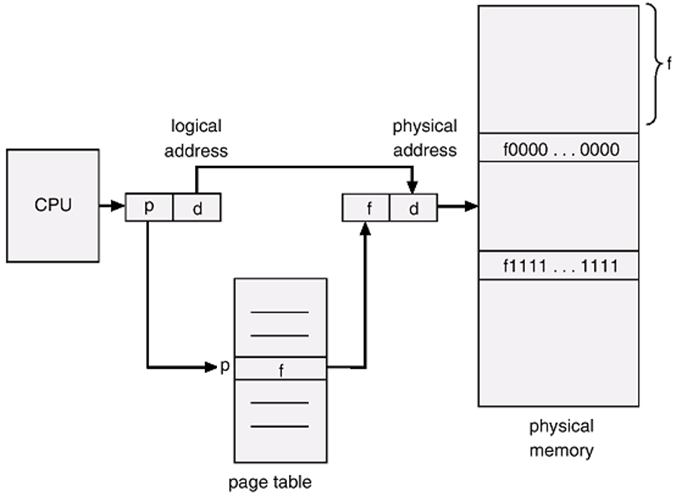
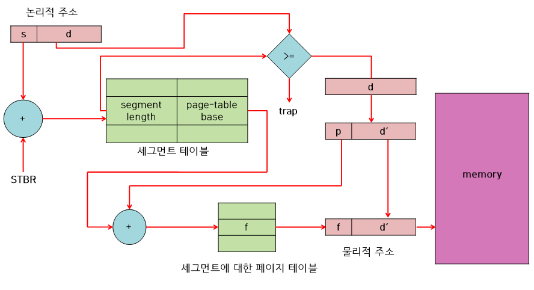

# 목차

 

- [목차](#목차)
- [1 주소 공간](#1-주소-공간)
- [2 주소 바인딩](#2-주소-바인딩)
- [3 메모리 관리와 관련된 용어](#3-메모리-관리와-관련된-용어)
- [4 물리적 메모리의 할당 방식](#4-물리적-메모리의-할당-방식)
    - [연속할당](#연속할당)
    - [불연속할당](#불연속할당)
- [5 페이징 기법](#5-페이징-기법)
  - [주소 변환 기법](#주소-변환-기법)
  - [페이지 테이블의 구현](#페이지-테이블의-구현)
    - [**TLB(Translation Look-aside Buffer)**](#tlbtranslation-look-aside-buffer)
    - [페이지 테이블과 TLB의 차이](#페이지-테이블과-tlb의-차이)
  - [계층적 페이징](#계층적-페이징)
  - [2단계 페이징 기법](#2단계-페이징-기법)
    - [2단계 페이징 기법을 통해 물리적 메모리에 접근하는 과정](#2단계-페이징-기법을-통해-물리적-메모리에-접근하는-과정)
    - [다단계 페이징 기법의 필요성](#다단계-페이징-기법의-필요성)
  - [역페이지 테이블](#역페이지-테이블)
  - [공유 페이지](#공유-페이지)
  - [메모리 보호](#메모리-보호)
  - [6 세그먼테이션, 페이지드 세그먼테이션](#6-세그먼테이션-페이지드-세그먼테이션)
  - [세그먼테이션](#세그먼테이션)
  - [페이지드 세그먼테이션](#페이지드-세그먼테이션)

 

# 1 주소 공간

* 주소란
  * 서로 다른 위치를 구분하기 위해 사용하는 일련의 숫자로 구성된 단위.
* 컴퓨터는 이진수로 주소를 표현한다.
  * 컴퓨터는 보통 32비트 혹은 64비트의 주소 체계를 사용한다. (운영체제보면 32bit, 64bit가 존재함.)
* 컴퓨터는 byte단위로 메모리 주소를 부여한다.
* 은유
  * 현실에서의 주소: 계층적으로 행정구역을 묶어서 주소를 표현한다. (ex. 서울시 서대문구 이화여대길 52번지)
    * 전체 주소 중 52번지는 건물 번호처럼 자세한 주소를 나타낸다.
  * 컴퓨터에서의 주소: 4KB(2^12바이트) 단위로 묶어서 페이지라는 행정구역을 묶어서 주소를 표현한다.
    * 32비트의 주소 중 하위 12비트(하나의 페이지)는 페이지 내에서의 주소를 나타내게 된다.

 

# 2 주소 바인딩
* 논리적 주소 (가상 주소)
  * 메모리에 적재되는 프로세스를 위한 독자적인 주소 공간.
  * 논리적 주소는 각 프로세스마다 독립적으로 할당되며 0번지부터 시작된다.
* 물리적 주소
  * 물리적 메모리(RAM)에 실제로 올라가는 위치를 말한다.
  * 낮은 주소 영역에는 운영체제가 올라가고, 높은 주소 영역에는 사용자 프로세스들이 올라간다.
* 주소 바인딩이란?
  * 프로세스가 실행되기 위해선 어쨋든 물리적 메모리에 올라가 있어야 한다.
  * **이렇게 프로세스의 논리적 주소를 물리적 메모리 주소로 연결시켜주는 작업을 주소 바인딩이라고 한다.**
* 주소 바인딩의 방식 3가지
  * 컴파일 타임 바인딩: 컴파일 시점에 해당 프로그램이 물리적 메모리의 몇 번지에 위치할 것인지 결정.
    * 프로그램이 절대주소로 적재된다는 의미. 주소를 변경하기 위해선 다시 컴파일 해야한다.
  * 로드 타임 바인딩: 프로그램 실행 시점에 로더에 의해 해당 프로그램이 물리적 메모리의 몇 번지에 위치할 것인지 결정.
    * 프로그램이 종료될 때까지 물리적 메모리상의 위치는 고정.
    * 로더 -> 사용자 프로그램을 메모리에 적재시키는 프로그램.
  * 실행시간 바인딩: 프로그램이 실행을 시작한 후에도 그 프로그램이 위치한 물리적 메모리 상의 주소가 변경될 수 있는 방식.
    * CPU가 메모리를 참조할 때마다 물리적 메모리에서 주소 매핑 테이블을 이용하여 데이터의 위치를 찾는다.
    * 이를 위해선 기준 레지스터, 한계 레지스터, MMU(Memory Management Unit)라는 하드웨어의 지원이 필요하다.

 

**MMU 기법**

* 물리적 주소 + 기준 레지스터 값 = 물리적 주소
  * CPU가 논리적 주소를 참조하려고 할 때 MMU기법은 그 주소값에 기준 레지스터의 값을 더해 물리적 주소값을 얻어낸다.
  * 즉, MMU기법에서는 프로그램의 주소 공간이 물리적 메모리의 한 장소에 연속적으로 적재되는 것으로 가정한다.
* 기준 레지스터 (재배치 레지스터): 현재 CPU에서 수행 중인 프로세스의 물리적 메모리 시작 주소가 저장되어 있다.

 

# 3 메모리 관리와 관련된 용어
* 동적로딩은 프로세스가 시작될 때 그 프로세스의 주소 공간 전체를 메모리에 모두 올려놓는 것이 아니라 해당 부분이 불릴 때만 올려놓기 때문에 보다 효율적으로 메모리를 사용할 수 있습니다. 예를 들어 에러처리와 같은 코드들을 실제로 많이 사용되지 않으므로 내려놓고 있다가 필요할 때만 올리게됩니다.
* 동적연결은 라이브러리 함수가 호출되는 시점에 라이브러리에 대한 연결이 이루어집니다. 동적연결은 다수의 프로그램이 공통으로 사용하는 라이브러리를 메모리에 한 번만 적재하므로 메모리 사용의 효율성을 높일 수 있습니다.
* 중첩(overlay)란 프로세스의 주소 공간을 분할해 실제 필요한 부분만을 메모리에 적재하는 기법입니다. 동적로딩과는 개념적으로 유사하나 사용하는 이유가 다릅니다. 중첩은 초창기 컴퓨터 시스템에서 물리적 메모리가 부족한 상황으로 인해 하나의 프로세스조차도 메모리에 올릴 수 없을 때 사용하던 기법인 반면, 동적로딩은 다중프로그래밍 환경에서 메모리 이용률을 높이기 위해서 사용하는 기법입니다.
* 스와핑(swapping)이란 메모리에 올라온 프로세스의 주소 공간 전체를 디스크의 스왑 영역(= 백킹스토어: backing store)에 일시적으로 내려놓는 것을 말합니다. 스와핑은 swap in과 swap out으로 나뉘며, 중기 스케줄러에 의해 발생합니다.

 

# 4 물리적 메모리의 할당 방식

- 프로세스를 메모리에 올리는 방식에 따른 분류

1. 연속할당 (contiguous allocation) : 각 프로세스를 물리적 메모리의 연속적 공간에 올리는 방식
   - 메모리를 분할하는 방식(분할을 관리하는 방식)에 따라 고정분할, 가변분할
2. 불연속할당 (noncontiguous allocation) : 하나의 프로세스를 물리적 메모리의 여러 영역에 분산해 적재하는 방식
   - 프로세스를 분할하는 방식에 따라 페이징, 세그멘테이션, 페이지드 세그멘테이션

### 연속할당

- 메모리를 분할하는 방식에 따른 분류

1. 고정분할 방식 : 물리적 메모리를 고정된 크기의 분할로 미리 나누어두는 방식

   - 물리적 메모리를 주어진 개수만큼의 영구적인 분할로 미리 나누어두고 각 분할에 하나의 프로세스를 적재
   - 분할의 크기는 모두 동일하게 할 수도 있고 서로 다르게 할 수도 있음
   - ❌ 하나의 분할엔 하나의 프로그램만 적재가능하기 때문에 동시에 메모리에 올릴 수 있는 프로그램의 수가 고정되어 있음
   - ❌ 수행 가능한 프로그램의 최대 크기도 제한되어 있음
   - ❌ 외부조각(프로그램의 크기 > 분할의 크기)과 내부조각(프로그램의 크기 < 분할의 크기)이 발생

2. 가변분할 방식 : 분할을 미리 나누어놓지 않고, 프로그램이 실행되고 종료되는 순서에 따라 분할을 관리하는 방식

   - 메모리에 적재되는 프로그램의 크기에 따라 분할의 크기, 개수가 동적으로 변하는 방식
   - ✅ 분할의 크기를 프로그램의 크기보다 크게 할당하지 않기 때문에 내부조각 발생 x
   - ❌ 이미 메모리에 존재하는 프로그램이 종료될 경우 중간에 빈 공간이 발생하게 되므로 외부조각은 발생할 수 있음
   - 크기가 n인 프로세스를 메모리에 올릴 때 물리적 메모리 내 가용 공간(메모리에 산발적으로 존재하는 빈공간) 중 어떤 위치에 올릴 것인가?

   1. 최초적합 (first-fit) : 크기가 n이상인 가용 공간 중 가장 먼저 찾아지는 곳에 프로세스 할당

      ✅ 가용 공간을 모두 탐색하지 않아도 되므로 시간적 측면에서 효율적

   2. 최적적합 (best-fit) : 크기가 n이상이면서 가장 작은 가용 공간에 프로세스 할당

      ✅ 공간적 측면에서 효율적

      ❌ 가용 공간들이 크기순으로 정렬되어 있지 않은 경우, 모든 가용공간을 탐색해야 하므로 시간적 오버헤드 발생

      ❌ 다수의 매우 작은 가용 공간들이 생성될 수 있음

   3. 최악적합 (worst-fit) : 가장 크기가 큰 곳에 새로운 프로그램 할당

      ❌ 최적적합과 마찬가지로 모든 가용 공간들을 탐색해야 하는 오버헤드 발생

      ❌ 상대적으로 더 큰 프로그램을 담을 수 있는 가용 공간을 빨리 소진한다는 문제점

   - 컴팩션 (compaction) : 가용 공간들을 한쪽으로 모아서 하나의 큰 가용 공간을 만드는 방법
     - ✅ 외부조각 문제를 해결
     - ❌ 현재 수행 중인 프로세스의 메모리상 위치를 상당부분 이동시켜야 하므로 비용이 많이 듬
     - ❌ 수행 중인 프로세스의 물리적 위치를 옮기는 것이므로 실행시간 바인딩 방식이 지원되는 환경에서만 가능

### 불연속할당

- 프로세스를 분할하는 방식에 따른 분류

1. 페이징 : 각 프로세스의 주소 공간을 동일한 크기의 페이지로 잘라 페이지 단위로 적재시키는 방식
2. 세그멘테이션 : 코드, 데이터, 스택 등 의미 있는 단위인 세그먼트로 나누어 세그먼트 단위로 적재시키는 방식
3. 페이지드 세그멘테이션 : 세그먼트 하나를 다수의 페이지로 구성하는 방식

 

# 5 페이징 기법

## 주소 변환 기법

페이징 기법에서는 CPU가 사용하는 논리적 주소를 **페이지 번호(p)**와 **페이지 오프셋(d)**으로 나누어 **주소 변환(address translation)**에 사용한다. **페이지 번호(p)**는 각 페이지별 주소 변환 정보를 담고 있는 **페이지 테이블 접근 시 인덱스(index)로 사용**되고, 해당 인덱스의 항목(entry)에는 그 페이지의 물리적 메모리상의 기준 주소(base address), 즉 시작 위치가 저장된다. 따라서 특정 프로세스의 p번째 페이지가 위치한 물리적 메모리의 시작 위치를 알고 싶다면 해당 프로세스의 페이지 테이블에서 p번째 항목을 찾아보면 된다.

한편 **페이지 오프셋(d)**은 **하나의 페이지 내에서의 변위**를 알려준다. 따라서 기준 주소값에 변위를 더함으로써 요청된 논리적 주소에 대응하는 물리적 주소를 얻을 수 있다.

 

## 페이지 테이블의 구현

**페이지 테이블**은 **페이징 기법에서 주소 변환을 하기 위한 자료구조**로, **물리적 메모리에 위치**하게 된다. 현재 CPU에서 실행 중인 프로세스의 페이지 테이블에 접근하기 위해 운영체제는 2개의 레지스터를 사용하는데, 이들은 각각 **페이지 테이블 기준 레지스터(page-table base register)**와 **페이지 테이블 길이 레지스터(page-table length register)**로 불린다.

- **페이지 테이블 기준 레지스터**는 **메모리 내에서의 페이지 테이블의 시작 위치**를 가리킨다.
- **페이지 테이블 길이 레지스터**는 **페이지 테이블의 크기를 보관**한다.

### **TLB(Translation Look-aside Buffer)**

.png)

페이징 기법에서의 메모리 접근 연산은 '주소 변환을 위해 페이지 테이블에 접근하는 것'과, '변환된 주소에서 실제 데이터에 접근하는 것', 이렇게 두 번의 메모리 접근을 필요로 한다. 즉 메모리에 한 번 접근하기 위해서는 매번 메모리에 두 번 접근해야 하는 오버헤드가 뒤따른다. 이와 같은 **페이지 테이블의 접근 오버헤드를 줄이고 메모리의 접근 속도를 향상**시키기 위해 **TLB(Translation Look-aside Buffer)**라고 불리는 **고속의 주소 변환용 하드웨어 캐시**가 사용되기도 한다. 메모리에 비해 TLB로 사용되는 하드웨어는 가격이 비싸기 때문에 페이지 테이블의 모든 정보를 담을 수는 없으며, 빈번히 참조되는 페이지에 대한 주소 변환 정보만을 담게 된다.

### 페이지 테이블과 TLB의 차이

**페이지 테이블**에는 하나의 프로세스를 구성하는 모든 페이지에 대한 주소 변환 정보가 페이지 번호에 따라 순차적으로 들어있기 때문에, 페이지 번호가 주어지면 테이블의 시작 위치에서 페이지 번호만큼 떨어진 항목에 곧바로 접근해 해당 페이지에 대응되는 프레임 번호를 얻을 수 있다.

반면 **TLB**를 사용한 주소 변환의 경웨는 프로세스의 모든 페이지에 대한 주소 변환 정보를 TLB가 가지고 있지 않기 때문에, 페이지 번호와 이에 대응하는 프레임 번호가 쌍으로 저장되어야 한다. 또한 TLB를 통한 주소 변환을 위해서는 해당 페이지에 대한 주소 변환 정보가 TLB에 있는지 확인하기 위해 TLB의 모든 항목(entry)을 다 찾아봐야 하는 오버헤드가 발생한다.

 

## 계층적 페이징

현대의 컴퓨터는 주소 공간이 매우 큰 프로그램을 지원한다. 예를 들어 32비트 주소 체계를 사용하는 컴퓨터에서는 2^32byte(=4GB)의 주소 공간을 갖는 프로그램을 지원할 수 있다. 각 페이지 테이블 항목이 4byte씩을 필요로 한다면 한 프로세스당 페이지 테이블을 위해 1Mx4byte 크기의 메모리 공간이 필요하게 된다. 그러면 수행 중인 프로세스의 수가 증가함에 따라 **전체 메모리의 상당 부분이 주소 변환을 위한 페이지 테이블에 할애되어 실제로 사용 가능한 메모리 공간이 크게 줄어들게 된다.** 즉, 페이지 테이블을 위한 메모리의 사용한 메모리의 사용은 심각한 공간 낭비를 유발한다. 따라서 **페이지 테이블에 사용되는 메모리 공간의 낭비를 줄이기 위해** **'2단계 페이징 기법'을 사용**한다.

 

## 2단계 페이징 기법

.png)

2단계 페이징 기법에서의 주소 변환에 대해서 살펴보자. 2단계 페이징 기법에서는 프로세스의 논리적 주소를 **두 종류의 페이지 번호(P1, P2)**와 페이지 **오프셋(d)**으로 구분한다. **첫 번째 페이지 번호(P1)**은 **외부 페이지 테이블의 인덱스**이고, **두 번째 페이지 번호(P2)**는 **내부 페이지 테이블의 인덱스**이다.

### 2단계 페이징 기법을 통해 물리적 메모리에 접근하는 과정

먼저 외부 페이지 테이블로부터 P1만큼 떨어진 위치에서 내부 페이지 테이블의 주소를 얻게 된다. 다음으로 내부 페이지 테이블로부터 P2만큼 떨어진 위치에서 요청된 페이지가 존재하는 프레임의 위치를 얻게 되고, 마지막으로 해당 프레임으로부터 d만큼 떨어진 곳에서 원하는 정보에 접근할 수 있게 된다.

### 다단계 페이징 기법의 필요성

프로세스의 주소 공간이 커질수록 페이지 테이블의 크기도 커지므로 주소 변환을 위한 메모리 공간 낭비 역시 더 심각해지게 된다. 따라서 2단꼐를 넘어 3단계, 4단계에 이르는 다단계 페이지 테이블이 필요하게 된다. 다단계 페이지 테이블을 사용하면 페이지 테이블을 위해 사용되는 메모리 공간의 소모는 줄일 수 있지만 그만큼 메모리 접근시간이 크게 늘어나는 문제가 발생할 수 있다.

이러한 메모리 접근에 의한 시간적인 오버헤드를 줄이기 위해서는 앞서 설명한 TLB를 사용하는 것이 효과적이다. TLB를 함께 사용하면 다단계 페이지 테이블로 인해 공간적인 이득을 얻을 수 있는 동시에, 메모리 접근시간도 그다지 늘어나지 않아 시간적인 효율성 또한 얻을 수 있게 된다.

 

## 역페이지 테이블

.png)

페이지 테이블로 인한 메모리 공간의 낭비가 심한 이유는 모든 프로세스의 모든 페이지에 대해 페이지 테이블 항목을 다 구성해야 하기 때문이다. 이 문제를 해결하기 위한 대안으로 **역페이지 테이블(inverted page table) 기법**이 사용될 수 있다. **역페이지 테이블 기법**은 **물리적 메모리의 페이지 프레임 하나당 페이지 테이블에 하나씩의 항목을 두는 방식**이다. 다시 말하면 논리적 주소에 대해 페이지 테이블을 만드는 것이 아니라, **물리적 주소에 대해 페이지 테이블을 만드는 것이다.** 즉 각 프로세스마다 페이지 테이블을 두지 않고, **시스템 전체에 페이지 테이블을 하나만 두는 방법**을 말한다. **페이지 테이블의 각 항목은 어느 프로세스의 어느 페이지가 이 프레임에 저장되었는지의 정보를 보관하고 있다. 즉 페이지 테이블의 각 항목은 프로세스 번호(pid)와 그 프로세스 내의 논리적 페이지 번호(P)를 담고 있게 된다.**

주소 변환 작업이 논리적 주소로부터 물리적 주소를 얻어내는 것임에 비해, **역페이지 테이블은 물리적 주소로부터 논리적 주소를 얻기 수월한 구조**로 되어 있다. 따라서 **역페이지 테이블에서의 주소 변환은 다수 비효율적인 측면이 있다.** 역페이지 테이블에 주소 변환 요청이 들어오면, 그 주소를 담은 페이지가 물리적 메모리에 존재하는지 여부를 판단하기 위해 페이지 테이블 전체를 다 탐색해야 하는 어려움이 있는 것이다. 이는 상당한 시간을 필요로 한다.

 

## 공유 페이지

**공유 코드(status code)**는 **메모리 공간의 효율적인 사용을 위해 여러 프로세스에 의해 공통으로 사용될 수 있도록 작성한 코드**를 말한다. 공유 코드는 **재진입 가능 코드(re-entrant code)** 또는 **순수 코드(pure code)**라고도 불린다. 또한 공유 코드는 읽기 전용(read-only)의 특성을 가지고 있다.

**공유 페이지(shared page)**란 **공유 코드를 담고 있는 페이지**를 말한다. 공유 페이지는 여러 프로세스에 의해 공유되는 페이지이므로 물리적 메모리에에 하나만 적재되어 메모리는 좀 더 효율적으로 사용할 수 있게 한다.

 

## 메모리 보호

페이지 테이블의 각 항목에는 주소 변환 정보뿐 아니라, 메모리 보호를 위한 **보호비트(protection bit)**와 **유효-무효 비트(valid-invalid bit)**를 두고 있다.

**보호비트**는 **각 페이지에 대한 접근 권한의 내용을 담고 있다.** 한 프로세스의 주소 공간은 다른 프로세스에 의해 접근될 수 없으므로 '누구'에 해당하는 접근 권한을 설정할 필요는 없으며, 각 페이지에 대해 '어떠한' 접근을 허용하는지의 정보가 보호비트에 저장된다. 즉 보호비트는 **각 페이지에 대해 읽기-쓰기/읽기전용 등의 접근 권한을 설정하는 데에 사용된다.**

**유효-무효비트**는 **해당 페이지의 내용이 유효한지(물리적 메모리에 해당 페이지가 존재하는 지)에 대한 내용을 담고 있다.** 유효-무효 비트가 '유효'로 세팅되어 있으며 해당 메모리 프레임에 그 페이지가 존재함을 뜻하며, 따라서 접근이 허용된다. 반면 '무효'로 세팅되어 있는 경우 프로세스가 그 주소 부분을 사용하지 않거나, 해당 페이지가 물리적 메모리에 올라와 있지 않고 백킹스토어에 존재해 해당 메모리 프레임에 유효한 접근 권한이 없다는 의미를 지닌다.

 

## 6 세그먼테이션, 페이지드 세그먼테이션

## 세그먼테이션

- 세그멘테이션 기법은 프로세스의 주소 공간을 의미 단위의 세그먼트로 나누어 물리적 메모리에 올리는 방법이다.
- 세그먼트는 이와 같이 주소 공간을 기능 단위 또는 의미 단위로 나눈 것을 뜻한다. 일반적으로는 코드(code), 데이터(data), 스택(stack) 등의 기능 단위로 세그먼트를 정의한다.
- 프로그램을 구성하는 함수 하나하나를 각각 세그먼트로 정의할 수도 있다.
- 세그먼트는 의미를 가질 수 있는 논리적인 단위이기 때문에 크기는 균일하지 않다.
- 세그먼테이션 기법에서는 논리적 주소가 <세그먼트 번호, 오프셋> 으로 나뉘어 사용된다.
- 세그먼트 번호는 해당 논리적 주소가 프로세스 주소 공간 내에서 몇 번째 세그먼트에 속하는지를 나타낸다.
- 오프셋은 그 세그먼트 내에서 얼마만큼 떨어져 있는지에 대한 정보를 나타낸다.
- 세그먼테이션 기법에서는 주소 변환을 위해 세그먼트 테이블을 사용한다.
- 이 때 세그먼트 테이블의 각 항목은 기준점(base)과 한계점(limit)를 가지고 있다.
- 기준점은 물리적 메모리에서 그 세그먼트의 시작 위치를 나타낸다.
- 한계점은 그 세그먼트의 길이를 나타낸다.
- 각 세그먼트의 길이는 균일하지 않으므로 세그먼트의 위치 정보 뿐 아니라 길이 정보를 함께 보관하고 있다.
- 세그먼테이션 기법에서도 세그먼트 테이블 기준 레지스터(Segment Table Base Register:STBR)와 세그먼트 테이블 길이 레지스터(Segment Table Length Register:STLR)를 사용한다.
- 세그먼트 테이블 기준 레지스터는 현재 CPU에서 실행 중인 프로세스의 세그먼트 테이블이 메모리의 어느 위치에 있는지 그 시작 주소를 담고 있다.
- 세그먼트 테이블 길이 레지스터는 그 프로세스 주소 공간이 총 몇 개의 세그먼트로 구성되는지 세그먼트의 개수를 나타낸다.
- 세그먼테이션 기법에서는 논리적 주소를 물리적 주소로 변환하기 전에 두 가지 사항을 먼저 확인한다.
- 첫 번째는 요청된 세그먼트 번호가 STLR에 저장된 값보다 작은 값인지 체크한다. 작은 값이라면 예외상황을 발생시킨다.
- 두 번째는 논리적 주소의 오프셋 값이 그 세그먼트의 길이보다 작은 값인지 체크한다.
- 논리적 주소의 오프셋 값과 해당 세그먼트 테이블의 엔트리의 limit 값을 비교한다.
- 두 가지 사항을 만족하면 유효한 메모리 접근 요청으로 판단해 주소 변환 작업이 이루어진다.
- 세그멘테이션 기법에서도 세그먼트 테이블의 각 엔트리에 보호비트와 유효비트를 둔다.
- 세그멘테이션 기법에서도 공유 세그먼트 개념을 지원한다. 공유되는 세그먼트는 이 세그먼트를 공유하는 모든 프로세스의 주소 공간에서 동일한 논리적 주소에 위치해야한다.
- 세그먼트는 의미 단위로 나누어져 있기 때문에 공유와 보안의 측면에서 페이징 기법에 비해 훨씬 효과적이다.
- 주소 공간의 일부를 공유하거나 특정 주소 공간에 읽기전용 등의 접근 권한 제어를 하고자 할 경우, 이는 어떤 의미 단위로 이루어지지 단순히 크기 단위로 수행되지 않기 때문이다.
- 예를들어 페이징 기법에서는 동일한 크기로 주소 공간을 나누다 보면 공유하려는 코드와 사유 데이터 영역이 동일 페이지에 공존하는 경우가 발생할 수 있다.
- 세그멘테이션 기법에서는 이러한 현상이 발생하지 않으므로 공유나 보안처럼 의미 있는 단위에 대해 수행하는 업무에서는 페이징 기법보다 세그먼테이션 기법이 장점을 가진다.
- 하지만 각 세그먼트는 길이가 균일하지 않으므로 외부 조각이 발생하고, 세그먼트를 어느 가용 공간에 할당하는지 결정해야하는 문제가 생긴다. frist fit, best fit 방식이 있다.

 

## 페이지드 세그먼테이션

- 페이징 기법과 세그먼테이션 기법은 각각 장단점을 깆고 있다.
- 이들 두 기법의 장점만을 취하는 주소 변환 기법으로 페이지드 세그먼테이션 기법이 있다.
- 페이지드 세그먼테이션은 프로그램을 의미 단위의 세그먼트로 나눈다.
- 단 하나의 세그먼트가 반드시 동일한 크기의 페이지들의 집합으로 구성되어야 한다.
- 그리고 물리적 메모리에 적재하는 단위는 페이지 단위 이다.
- 즉, 페이지드 세그먼테이션 기법에서는 하나의 세그먼트 크기를 페이지 크기의 배수가 되도록 함으로써 세그먼테이션 기법에서 발생하는 외부조각의 문제점을 해결한다.
- 그리고 세그먼트 단위로 프로세스 간의 공유나 프로세스 내의 접근 권한 보호가 이루어지도록 함으로써 페이징 기법의 약점을 해소한다.
- 즉, 페이지드 세그먼테이션 기법에서는 주소 변환을 위해 외부의 세그먼트 테이블과 내부의 페이지 테이블 이렇게 두 단계의 테이블을 이용한다. 이는 2단계 페이지 테이블과 유사한 구조라 할 수 있다.
- <세그먼트 번호 s, 오프셋 d>으로 구성된 논리적 주소를 물리적 주소로 변환하는 과정은 다음과 같다.
  1. 먼저 STBR로 메모리에 적재되어있는 Segment Table을 찾는다.
  2. 논리적주소의 세그먼트 번호 s를 Segment Table의 인덱스로 사용하여 해당 엔트리를 찾는다. 엔트리에는 해당 세그먼트의 길이와, 세그먼트를 구성하는 Page들의 Page Table의 시작 주소가 들어있다. 만약 세그먼트 길이보다 오프셋 값 d가 크다면 trap에 걸린다.
  3. 논리적 주소 d로부터 페이지 번호 p와 페이지 오프셋 d’를 얻어낸다. 페이지 번호를 페이지 테이블의 인덱스로 사용하여 페이지 프레임 번호 f를 얻어낸다.
  4. 페이지 프레임 번호 f와 페이지 오프셋 d’를 더해서 물리적 주소를 얻어낸다.

