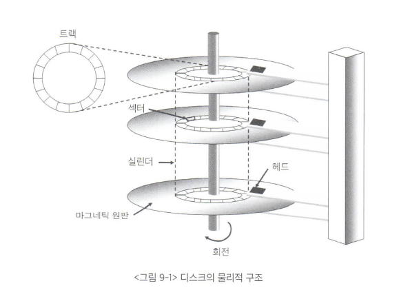
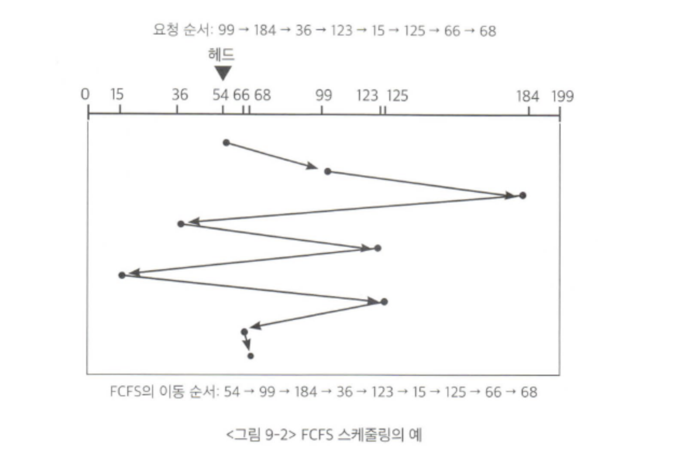
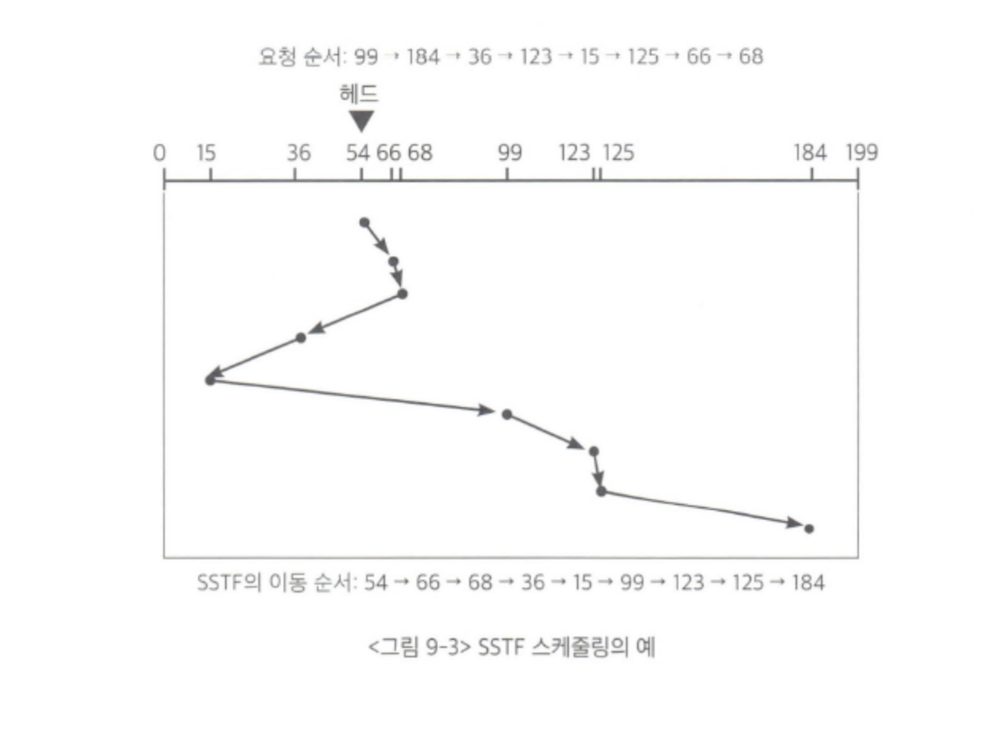
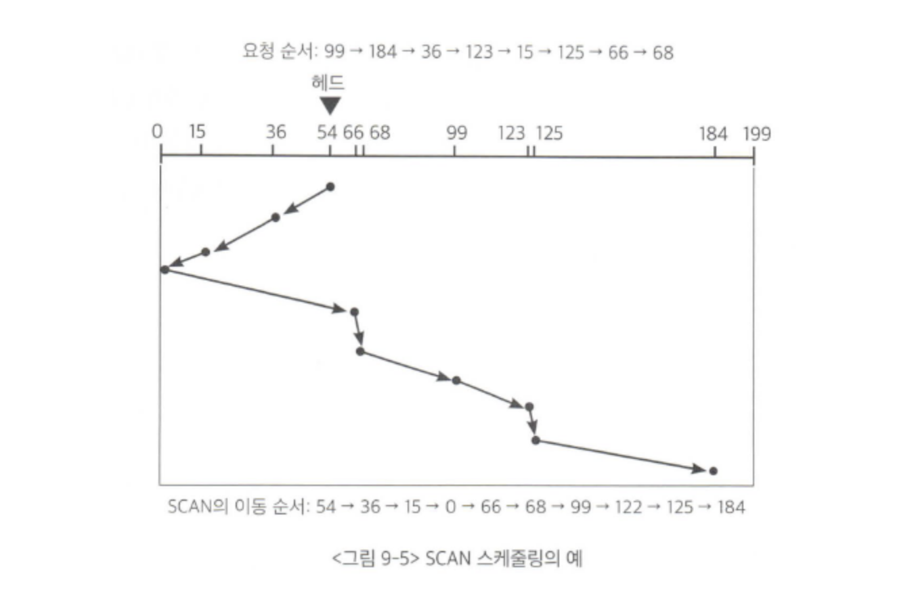
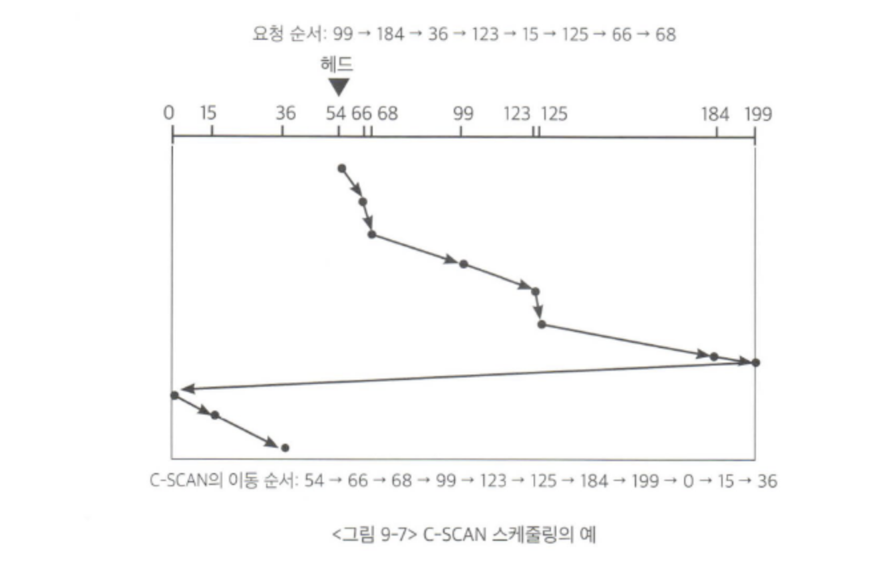
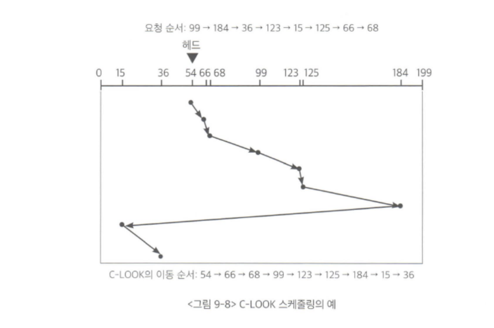

## 목차
- [디스크 관리](#디스크-관리)
  - [디스크 구조](#디스크-구조)
  - [디스크 스케줄링](#디스크-스케줄링)
    - [FCFS 스케줄링](#fcfs-스케줄링)
    - [SSTF 스케줄링](#sstf-스케줄링)
    - [SCAN 알고리즘](#scan-알고리즘)
    - [C-SCAN 알고리즘](#c-scan-알고리즘)
    - [LOOK과 C-LOOK 알고리즘](#look과-c-look-알고리즘)
  - [다중 디스크 환경에서의 스케줄링](#다중-디스크-환경에서의-스케줄링)
  - [디스크의 저전력 관리](#디스크의-저전력-관리)
    - [비활성화 기법](#비활성화-기법)
    - [회전속도 조절 기법](#회전속도-조절-기법)
    - [디스크의 데이터 배치 기법](#디스크의-데이터-배치-기법)
    - [버퍼캐싱 및 사전인출 기법](#버퍼캐싱-및-사전인출-기법)
    - [쓰기전략을 통한 저전력 디스크 기법](#쓰기전략을-통한-저전력-디스크-기법)

# 디스크 관리

## 디스크 구조
디스크 외부에서는 디스크를 일정한 크기의 1차원 배열처럼 취급하게 된다. 이 일정한 크기의 저장 공간을 논리블록 이라고 한다.  
디스크에 데이터가 저장될 때는 논리블록 단위로 저장되고, 디스크 외부로 입출력이 일어날 때에도 논리블록 단위로 전송된다.  
논리블록이 저장되는 디스크 내의 물리적인 위치를 섹터라고 부른다. 즉, 논리블록 하나가 섹터 하나와 1 대1로 매핑되어 저장되는 것이다.  

디스크의 물리적인 구조는 마크네틱의 원판으로 구성된다. 하나의 디스크 내에 원판의 수는 하나 일 수도 있고 여러개 일 수도 있다. 각각의 원판은 트랙으로 구성되고 각 트랙은 섹터로 나뉘며, 섹터에 최소한의 단위 정보가 저장된다. 여러 개의 원판에서 상대적 위치가 동일한 트랙들의 집합을 실린더라고 부른다.

 

## 디스크 스케줄링
디스크에 대한 접근시간은 탐색시간과 회전지연시간, 전송시간으로 구분된다. 

- 탐색시간
  - 디스크 헤드를 해당 실린더 위치로 이동시키는데 걸리는 시간
- 회전지연시간
  - 디스크가 회전해서 읽고 쓰려는 섹터가 헤드 위치에 도달하기까지 걸리는 시간
- 전송시간
  - 해당 섹터가 헤드 위치에 도달한 후 데이터를 실제로 섹터에 읽고 쓰는데 소요되는 시간

- 디스크 입출력 효율을 높이기 위해서는 디스크 접근시간을 최소화해야 함 (BUT 회전지연시간과 전송시간은 수치도 작고 통제하기 힘듦 ⇒ **탐색시간을 최소화!**)
- **디스크 스케줄링** : 여러 섹터들에 대한 입출력 요청이 들어왔을 때 어떤 순서로 처리할 것인지 결정하는 매커니즘 ⇒ **디스크 헤드의 이동거리를 줄이는 것이 목표!**

### FCFS 스케줄링
> FCFS(First Come First Served) 스케줄링  
> 디스크에 먼저 들어온 요청을 먼저 처리하는 방식

실린더 위치 : 0-199, 현재 헤드 : 54, 요청 : **99 184 36 123 15 125 66 68**

- 디스크 헤드가 54번 실린더에서 출발해 99 > 184 > 36 > ... 순으로 이동
- 총 헤드의 이동거리 : 644

- ex. 은행창구, 매표소
- 디스크 헤드가 움직이면서 서비스를 해야하므로 효율성이 매우 떨어짐

### SSTF 스케줄링
> SSTF(Shortest Seek Time First) 스케줄링  
> 헤드의 현재 위치로부터 가장 가까운 위치에 있는 요청을 제일 먼저 처리하는 알고리즘  

실린더 위치 : 0-199, 현재 헤드 : 54, 요청 : **99 184 36 123 15 125 66 68**

- 현재 위치 54에서 가장 가까운 66번 요청 먼저 처리 > 68 > 36 > ...
- 총 헤드의 이동거리 : 236

- 기아 현상(starvation) : 현재 위치로부터 가까운 요청이 지속적으로 들어올 경우 멀리 떨어진 곳의 요청은 무한히 기다려야 함
- 헤드의 이동거리 측면에서 가장 우수한 알고리즘은 아니다.

### SCAN 알고리즘
> SCAN 알고리즘  
> 헤드가 디스크 원판의 안쪽 끝과 바깥쪽 끝을 오가며, 그 경로에 존재하는 모든 요청을 처리하는 방식

실린더 위치 : 0-199, 현재 헤드 : 54, 요청 : **99 184 36 123 15 125 66 68**
- 헤드가 현재 위치 54에서 0번 방향으로 이동중이라면 36 > 15 > 0에서 방향 바꾸고 > 66 > ...
- 총 헤드의 이동거리 : 238

- 엘레베이터에서 사용하는 스케줄링 알고리즘과 유사하다
- FCFS처럼 불필요한 헤드 이동 없음
- SSTF처럼 일부 지역이 지나치게 오래 기다리는 기아 현상 없음
- 효율성과 형평성 모두 만족하는 알고리즘
- 모든 실린더 위치의 기다리는 시간이 공평하지는 않음 (끝쪽보다 가운데 위치가 기다리는 평균시간이 더 짧음)

### C-SCAN 알고리즘
> C-SCAN(Circular-SCAN) 알고리즘  
> 헤드가 한쪽 끝에서 다른 쪽 끝으로 이동하며 가는 길목에 있는 요청을 처리한다. 그런 방향을 바꾼 후에는 요청을 처리하지 않고 다시 출발점으로 이동한다.

실린더 위치 : 0-199, 현재 헤드 : 54, 요청 : **99 184 36 123 15 125 66 68**

- 현재 위치 54에서 199까지 가면서 66 > 68 > 99 > 123 > ...
- 총 헤드의 이동거리 : 380

- SCAN보다 헤드의 이동거리는 길어지지만 탐색시간의 편차를 줄일 수 있다.

### LOOK과 C-LOOK 알고리즘
> LOOK 알고리즘  
> 헤드가 한쪽 방향으로 이동하다가 그 방향에 더 이상 대기 중인 요청이 없으면 헤드의 이동방향을 즉시 반대로 바꾸는 스케줄링 방식

실린더 위치 : 0-199, 현재 헤드 : 54, 요청 : **99 184 36 123 15 125 66 68**

- 현재 위치 54에서 66 > 68 > ... 까지는 SCAN과 동일하지만 184에서 더이상 요청이 없으므로 바로 방향을 바꿈

- C-LOOK은 C-SCAN과 비슷
- 헤드가 반드시 끝까지 이동하는 것이 아니라 요청이 존재하는 가장 낮은 번호까지만 이동하므로 디스크 이동거리 줄일 수 있음

LOOK, C-LOOK 알고리즘이 효율적인 것으로 알려져 있다.

 

## 다중 디스크 환경에서의 스케줄링

__다수의 디스크를 함께 사용하면 장점__

- 동일한 정보를 여러 디스크에 중복 저장함으로써 인기 있는 데이터를 여러 디스크로부터 동시에 서비스할 수 있음
- 일부 디스크에 오류가 발생해도 지속적인 서비스가 가능함
- 정보의 유실을 방지할 수 있음
- 시스템의 성능과 신뢰성을 동시에 향상시킬 수 있음

이러한 환경에서는 같은 데이터가 저장되어 있는 여러 개의 디스크 중 어느 디스크에서 요청을 처리할 지 결정하는 스케줄링 문제가 발생하게 된다.  
앞서 얘기한 스케줄링은 디스크 내에서 필요하다면, 다중 디스크에서의 스케줄링은 작업을 수행할 디스크를 결정하는 문제가 포함된다.  

__스케줄링 목표__

- 탐색 시간을 줄일 수 있음
- 각 디스크 간의 부하 균형을 이루어야함.
- 전력 소모를 줄이기 위해서
  - 모든 디스크를 사용하기보다는 일부 디스크에만 사용

 

## 디스크의 저전력 관리

### 비활성화 기법

- 디스크의 상태는 전력소모를 기준으로 크게 네 가지 상태로 구분
  1. 활동 (active) 상태 : 현재 헤드가 데이터를 읽거나 쓰고 있는 상태
  2. 공회전 (idle) 상태 : 디스크가 회전중이지만 데이터를 읽거나 쓰지는 않는 상태
  3. 준비 (standby) 상태 : 디스크가 회전하지 않지만 인터페이스가 활성화된 상태
  4. 휴면 (sleep) 상태 : 디스크가 회전하지 않고 인터페이스도 비활성화된 상태

⇒ 1,2는 활성 상태 / 3,4는 비활성 상태

- 요청이 없는 경우 디스크를 정지시키는 것이 전력 절감 측면에서 효과적

### 회전속도 조절 기법

- 디스크의 회전속도를 가변적으로 조절하는 기법

### 디스크의 데이터 배치 기법

- 디스크 내에 데이터의 복제본을 많이 만들어 헤드 위치에서 가까운 복제본에 접근하도록 하는 기법

### 버퍼캐싱 및 사전인출 기법

- 디스크가 저전력 모드일 때는 입출력 처리를 최대한 지연시켰다가 정상 전력 모드로 돌아왔을 때 사전인출을 공격적으로 하는 기법

### 쓰기전략을 통한 저전력 디스크 기법

- 디스크가 비활성 상태일 때는 쓰기를 하지 않고 기다렸다가, 활성상태로 돌아왔을 때 쓰는 방식