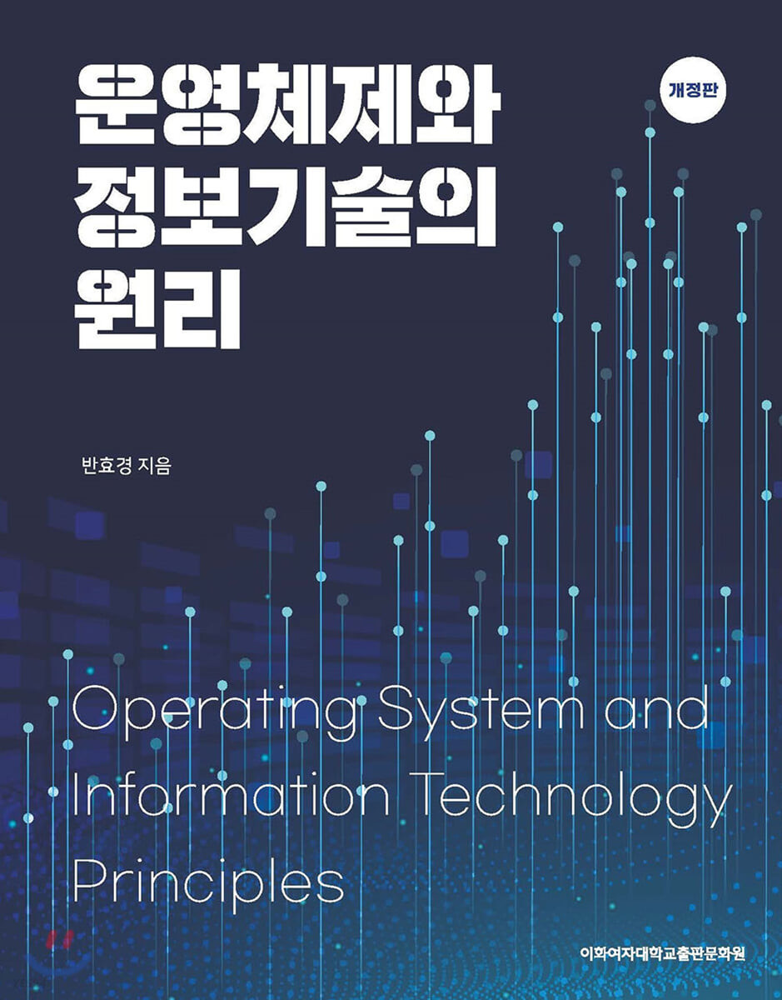

# operating-system
운영체제 스터디

- [2장 운영 체제 개요](https://github.com/woowacourse-cs-study/operating-system/blob/main/2%EC%9E%A5%20%EC%9A%B4%EC%98%81%EC%B2%B4%EC%A0%9C%20%EA%B0%9C%EC%9A%94.md)
- [3장 컴퓨터 시스템의 동작원리](./3장%20컴퓨터%20시스템의%20동작원리.md)
- [4장 프로그램 구조와 실행](./4장%20프로그램%20구조와%20실행.md)
- [5장 프로세스 관리](./5장%20프로세스%20관리.md)
- [6장 CPU 스케줄링](./6장%20CPU%20스케줄링.md)

